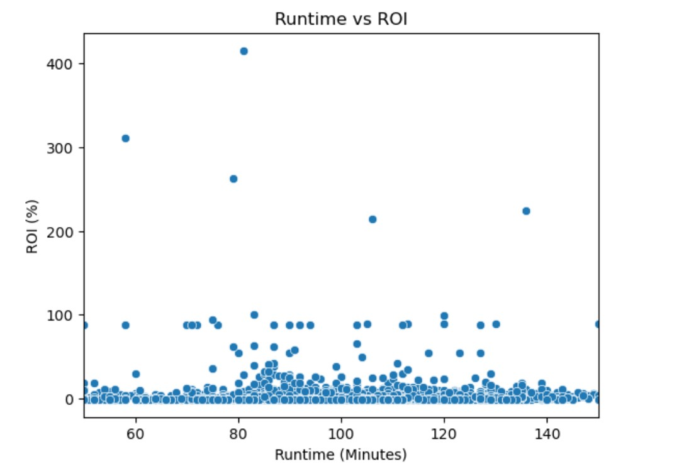

# Movie Recommendations


## Overview
Your company is planning to launch a movie studio, and I’ve been tasked with identifying the best path forward. My goal is to present three actionable recommendations to guide your company in building a successful and competitive movie studio.

## Business Understanding

Here are the questions I would like to answer:

What genres perform the best?
What is the ideal release date?
Are there certain people involved in the most successful movies (directors, actors, or writers)?

### Success Metric

We will measure how much of the production budget was made back. A film is generally considered a success if it makes back at least 2x its budget. Therefore we will be judging success by ROI and looking for ROI of at least 100% to be considered a success.

ROI = ((worldwide gross - production budget) / production budget) x 100

### Data
BOM Movie Gross (csv) - Used for movie revenue for our ROI metric
IMDB (Database) - Used for movie details
Movie Budgets (csv) - Used to assess a movie's budget to factor into the ROI metric


## Data Understanding and Analysis

### Genre


### Runtime


### Director


## Conclusion

### Recommendation 1
To optimize the selection of movies, it is recommended to focus on genres such as Musicals, Horror, and Mystery, as these categories have shown the highest average returns on investment (ROI). Musicals have the highest ROI at 904.48, followed by Horror at 656.16, and Mystery at 554.38. Targeting films within these genres could lead to greater profitability.

### Recommendation 2
It is advisable to focus on movies with a runtime between 50 and 150 minutes, with an ideal target around 93.7 minutes. This range has been associated with higher audience engagement and satisfaction, making it a strategic choice for film production and distribution.

### Recommendation 3
Focusing on directors with proven track records in delivering high ROI, such as Henry Joost, James Wan, and M. Night Shyamalan, is recommended. Their past works have consistently contributed to successful films, making them valuable assets for future projects in terms of both creativity and box-office performance.

## Next Steps
* Split out analysis by domestic and foreign revenue depending on where our theatre is planning to operate and show our movies
* See if there is a change in results when you analyze short films and feature length films separately.


## For More Information

See the full analysis in the [Jupyter Notebook](./notebooks/final.ipynb) or review this [presentation](./Movie_Recommendations_Presentation.pdf).

For additional info, contact Hannah Dallas at [hrdallas1@gmail.com](mailto:hrdallas1@gmail.com.com)

## Repository Structure

```
├── images
├── notebooks
├── zippedData
├── README.md
├── Movie_Recommendations_Presentation.pdf